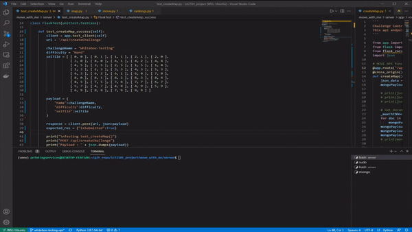
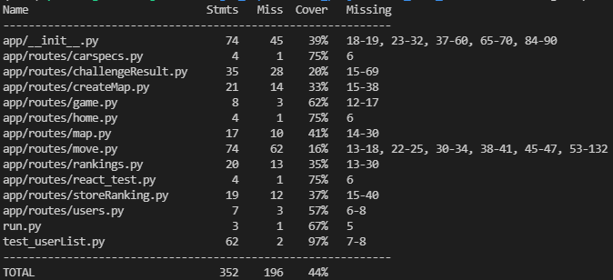
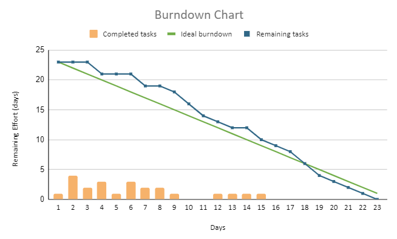
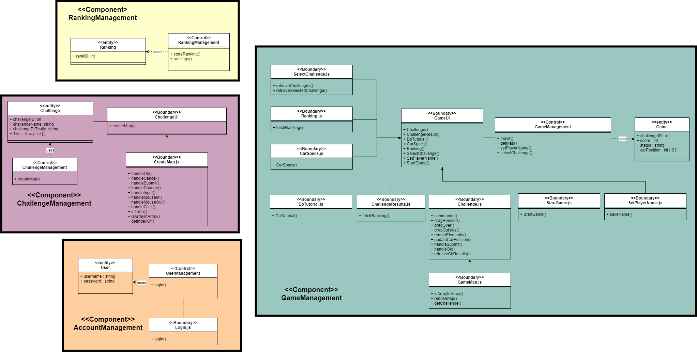

# Move with Me

## How to run

### Setup dependencies
This web application will run Python Flask for its backends and MVC structure. MongoDB will be interfaced by Flask application for database purposes. React is used to handle frontend for user interactions with the application.

### Overview of Application
|Service|IPv4|Port|Proxy|
|--|--|--|--|
|React|IPv4 of WSL (Win), localhost (Mac)|3000|5000|
|Flask|localhost|5000|\-|
|MongoDB|localhost|27017|\-|

**Entry Point** @ http://localhost:3000

#### Cloning reposiotry
```bash
# via HTTPS
git clone https://github.com/nicchongwb/ict2101_project.git
# via SSH
eval $(ssh-agent -s)
ssh-add <ssh private-key>
git clone git@github.com:nicchongwb/ict2101_project.git

cd ict2101_project/move_with_me
```

#### Setup NodeJS environment
```bash
sudo apt update
curl -o- https://raw.githubusercontent.com/nvm-sh/nvm/v0.38.0/install.sh | bash
source ~/.bashrc
nvm --version # Check version ensure its v14.17.0
nvm ls-remote # list all node versions from remote repo
nvm install v14.17.0 # We all work on this version
nvm alias default v14.17.0
```

#### Start frontend : React
```bash
cd ict2101_project/move_with_me
npx create-react-app client
npm install
cd client
npm start
```

#### Start backend : Flask
```bash
cd ict2101_project/move_with_me/server
python3 -m venv venv # Create a python environmment
. venv/bin/activate # Start python environment (WSL/Linux)
source venv/bin/activate # Start python environment (MAC OS)
pip install -r requirements.txt
FLASK_APP=app.py FLASK_ENV=development flask run # Run Flask in debug mode

#### Starting backend : MongoDB
```bash
cd ict2101_project/move_with_me/server
sudo apt-get install mongodb # Install mongodb into system
mkdir -p /data/db # For linux system
sudo mongod # Start mongodb

# Loading json collections (will autocreate if not exist)
mongoimport --db mvm_db --collection <collection> --file mongodb/scripts/<collection>.json
```

#### MongoDB structure

|Structure|Name|
|--|--|
|Database|mvm_db|
|Collection|Users, Challenges, Rankings|

---

## Development Workflow

1. Create branch for feature/class, refer to Github branch management guide below
2. After a function of a feature is complete and **accepted**, push it to the parent branch (feature)
3. After a feature is completed and **accepted**, push it to the parent branch (component)
4. Proceed to UAT for respective functions.
5. If a component/feature/function fails the UAT, create an issue and rectify in respective dev branch.

### Github branch management guide
Phases includes : dev, UAT
Component includes : name of component (ref to component diagram)
Feature includes : name of classes (Entity, Control, Boundary, Interface)
Function includes : respsective functions of each feature/class 

```
<phase>-<component>-<feature>
dev-<component>-<feature>-<function>
dev-AccountManagement-UserEntity
dev-AccountManagement-UserController
dev-AccountManagement-UserBoundary
```
If a feature is too complex, eg. GameBoundary then we can split further with following
```
dev-AccountManagement-GameBoundary
dev-AccountManagement-GameBoundary-<function>
```

Commands to use
```bash
git branch # see which branch
git checkout -b <branch name> # Create a new branch and switch to it
git checkout -b <branch name> <branching from> # Create a new branch branching from a branch and switch to it 

Example to create a feature branch:
git switch dev
git checkout -b dev/<component> # Create the compononet branch if not exist
git checkout -b dev/<component>/<feature>
git checkout -b dev/<component>/<feature> dev

# Staging and commit
git add . # this will add all changes, if you don't wish to do that, then don't use .
git commit -m "Enter message here"
git pull
git push
```

## UAT
[](https://www.youtube.com/watch?v=7qmEdSadc5Y&feature=youtu.be)

## Whitebox Testing

Whitebox testing was mainly performed on the Flask API endpoints. For example, the storeRanking test case tests for the interaction between GameManagement class and RankingManagement class.

|Test Case|Class|
|--|--|
|storeRanking|RankingManagment|
|rankings|RankingManagement|
|move|GameManagement|
|map|GameManagement|
|createMap|GameManagement|
|challengeResult|RankingManagement|



### Running test cases
 - unittest was used to model the test cases.
 - coverage was used to generate coverage statistics of the test results.
```bash
# Ensure that you are in whitebox-testing branch
. venv/bin/activate
pip install -r requirements.txt
python test_<name>.py # Run the respective testcase
coverage run # Run coverage
coverage report -m # Get report
```

## M3 Overview



Due to the capability of the team and irregular schedule in timetables, the team did not manage to complete all the features. However, the team took the project to emulate a prototype lifecycle. Main features such as the Game, Score and User component were prioritized. After completing a vialbe product of the aforementioned features, the team went on to develop the Ranking component to complete the basic features of the application. The team then proceed to testing phase. 

## Other Links
- [Troubleshoot](https://github.com/nicchongwb/ict2101_project/blob/main/wiki/Troubleshoot.md)
- [Useful Links](https://github.com/nicchongwb/ict2101_project/blob/main/wiki/Useful_links.md)
